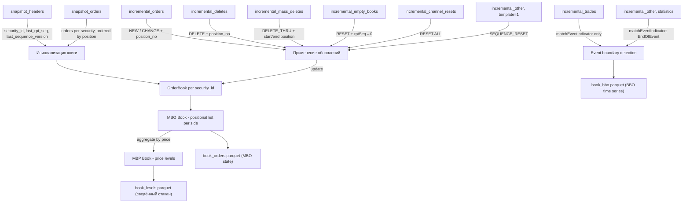

# Алгоритм сборки сведённого стакана (Consolidated Order Book)

## Контекст

B3 UMDF Binary публикует **только Market-By-Order (MBO)** — каждая запись в стакане представляет индивидуальную заявку. Агрегированный стакан по ценовым уровням (Market-By-Price / Top-Of-Book) **не предоставляется биржей** и должен быть построен клиентом самостоятельно.

> [!IMPORTANT]
> **Наши данные от 2024-11-18 используют `schema_version = 9` (семантическая версия 1.8.0).**
> В этой версии управление книгой — **позиционное** (`mDEntryPositionNo` определяет место заявки).
> Весь алгоритм ниже описан для позиционной модели. Модель Price/SecondaryOrderID (spec v2.1.0+) описана в [Приложении A](#приложение-a-модель-pricesecondaryorderid-spec-v210).

---

## Необходимые Parquet-таблицы

### Основные таблицы для сборки книги

| # | Таблица | Template ID | Источник | Назначение |
|---|---------|-------------|----------|------------|
| 1 | `snapshot_headers.parquet` | `SnapshotFullRefresh_Header_30` | Snapshot stream | Метаданные снапшота: `security_id`, `last_msg_seq_num_processed`, `tot_num_bids`, `tot_num_offers`, `last_rpt_seq`, `snapshot_header_row_id` |
| 2 | `snapshot_orders.parquet` | `SnapshotFullRefresh_Orders_MBO_71` | Snapshot stream | Начальное состояние книги: `security_id`, `side`, `price`, `size`, `position_no`, `secondary_order_id`, `md_insert_timestamp_ns` |
| 3 | `incremental_orders.parquet` | `Order_MBO_50` | Incremental stream | Добавление/изменение заявок: `security_id`, `md_update_action` (NEW/CHANGE), `side`, `price`, `size`, `position_no`, `secondary_order_id`, `rpt_seq` |
| 4 | `incremental_deletes.parquet` | `DeleteOrder_MBO_51` | Incremental stream | Удаление одной заявки: `security_id`, `side`, `position_no`, `secondary_order_id`, `size`, `rpt_seq` |
| 5 | `incremental_mass_deletes.parquet` | `MassDeleteOrders_MBO_52` | Incremental stream | Mass delete: `security_id`, `side`, `position_no`, `md_update_action` (`DELETE_THRU` / `DELETE_FROM`), `rpt_seq` |
| 6 | `incremental_empty_books.parquet` | `EmptyBook_9` | Incremental stream | Полный сброс книги инструмента: `security_id`, `match_event_indicator_raw` |
| 7 | `incremental_channel_resets.parquet` | `ChannelReset_11` | Incremental stream | Сброс всех книг канала: `match_event_indicator_raw` |

### Вспомогательные таблицы

| # | Таблица | Назначение |
|---|---------|------------|
| 8 | `instruments.parquet` | Справочник инструментов (`security_id`, `symbol`, `min_price_increment`, `price_divisor`) |
| 9 | `incremental_trades.parquet` | Сделки — **не меняют книгу**, но несут `matchEventIndicator` (определение границ событий) и `rpt_seq` |
| 10 | `incremental_other.parquet` | Содержит `SequenceReset` (template_id=1), `SecurityStatus`, `SecurityGroupPhase` и прочие. **`SequenceReset` критичен** для корректной обработки пакетного счётчика |
| 11 | `errors.parquet` | Ошибки парсинга — для отслеживания пропусков в данных |

### ✅ Отсутствующие таблицы

**Все необходимые таблицы уже имеются.** Декодер (`cpp_decoder`) уже сохраняет все ключевые сообщения в отдельные parquet-файлы. Никакие дополнительные проходы по PCAP не требуются.

> [!NOTE]
> `EmptyBook_9` и `ChannelReset_11` декодируются в отдельные файлы внутри `feed_A/` и `feed_B/` директорий каждого канала. `SequenceReset` попадает в `incremental_other.parquet` (template_id=1).

---

## Порядок сборки сведённого стакана

### Шаг 0: Загрузка справочника инструментов

1. Прочитать `instruments.parquet` → построить словарь `security_id → InstrumentInfo`
2. Извлечь `min_price_increment`, `price_divisor` для нормализации цен

### Шаг 1: Инициализация книги из снапшота

```
Для каждого channel_XX/:
  1. Загрузить snapshot_headers.parquet
     Для каждого security_id:
       - Запомнить last_msg_seq_num_processed  (пакетная точка синхронизации)
       - Запомнить last_rpt_seq               (rptSeq точка синхронизации per instrument)
       *** - Запомнить last_sequence_version   (версия последовательности пакетов) ***
       - Проверить tot_num_bids + tot_num_offers

  2. Загрузить snapshot_orders.parquet
     - Связь с header через snapshot_header_row_id
     - Для каждого ордера из снапшота (отсортированного по row_in_group):
       → Добавить в конец списка: book[security_id][side].append(OrderState(price, size, ...))
       (ордера приходят уже в правильном порядке — position 1, 2, 3, ...)
```

> [!IMPORTANT]
> **Проверка `sequenceVersion`:** При синхронизации снапшота с инкрементальным потоком необходимо убедиться, что `lastSequenceVersion` из снапшота совпадает с `sequenceVersion` пакетов инкрементального потока. Если `lastSequenceVersion` снапшота **меньше** текущей `sequenceVersion` инкрементального потока — снапшот устарел, необходимо дождаться нового цикла снапшотов (docs/spec.txt:3308-3337, 3716-3745).

> [!NOTE]
> Если для инструмента нет записи в `snapshot_headers` (или `tot_num_bids = tot_num_offers = 0`), книга считается пустой. Это нормально для неликвидных инструментов.

### Шаг 2: Построение нормализованного потока инкрементальных событий

Объединяем **все** инкрементальные таблицы в единый поток, сортированный по:

```
PRIMARY:   packet_sequence_number   (порядок пакетов в канале — глобальный)
SECONDARY: message_index_in_packet  (порядок сообщений внутри пакета)
```

> [!WARNING]
> **`rpt_seq` НЕ является глобальным ключом сортировки.** Это счётчик per `security_id`, который сбрасывается в 1 после каждого `EmptyBook` для данного инструмента (docs/spec.txt:3528-3530). Использовать его для сравнения сообщений **разных** инструментов нельзя. `rpt_seq` служит только для gap detection и отсечки дублей в рамках одного `security_id`.

В поток включаем:

| Источник | Событие | Влияет на книгу |
|----------|---------|-----------------|
| `incremental_orders` | `NEW`, `CHANGE` | ✅ Да |
| `incremental_deletes` | `DELETE` | ✅ Да |
| `incremental_mass_deletes` | `DELETE_THRU` | ✅ Да |
| `incremental_empty_books` | `EMPTY_BOOK` | ✅ Да (сброс) |
| `incremental_channel_resets` | `CHANNEL_RESET` | ✅ Да (сброс всего канала) |
| `incremental_other` (template_id=1) | `SEQUENCE_RESET` | ✅ Да (сброс пакетного счётчика) |
| `incremental_trades` | `TRADE` | ❌ Не меняет книгу, но нужен для `matchEventIndicator` |
| `incremental_other` (прочие) | Статистики, статусы, бэнды | ❌ Не меняет книгу, но несёт `EndOfEvent` |

> [!IMPORTANT]
> **`incremental_trades` и прочие статистики** не обновляют книгу, но **обязаны** участвовать в обработке `matchEventIndicator`. Бит `EndOfEvent` (bit 7) часто ставится именно на последнем не-книжном сообщении события (типично — `ExecutionStatistics`). Если полностью игнорировать эти сообщения, определение границ событий будет некорректным.

### Шаг 2a: Обработка SequenceReset (template_id = 1) в инкрементальном потоке

`SequenceReset` в инкрементальном потоке приходит при критическом сбое или при инициализации (docs/spec.txt:3396-3418). Клиент обязан:

```python
def handle_sequence_reset(new_seq_no, channel):
    """SequenceReset в incremental stream."""
    # 1. Сбросить пакетный счётчик на значение из NewSeqNo
    channel.expected_packet_seq = new_seq_no
    
    # 2. sequenceVersion в packet header будет инкрементирован
    #    → все текущие книги потенциально протухли
    
    # 3. Ожидаем EmptyBook + recovery Order_MBO для каждого инструмента
    #    (с matchEventIndicator bit 5 = RecoveryMsg)
    
    # В офлайн-разборе: при встрече SequenceReset нужно быть готовым к тому,
    # что packet_sequence_number перескочит на new_seq_no.
    # Не считать это gap'ом.
```

> [!NOTE]
> `SequenceReset` хранится в `incremental_other.parquet` с `template_id=1`. В snapshot и instrument definition streams `SequenceReset` означает конец цикла — это другая семантика, не влияющая на книгу.

### Шаг 3: Отсечение уже учтённых событий

> [!NOTE]
> В текущей реализации (`orderbook/replay.py`) отсечка делается по `last_msg_seq_num_processed` **на уровне канала** (один упорядоченный поток `feed_A`/`feed_B`). `rpt_seq` используется только для логирования. Переход к per-security отсечке ещё не реализован.

### Шаг 4: Применение каждого события к книге (позиционная модель — schema v9)

---

#### 4.0 SequenceReset (template_id = 1)

**Фактическая обработка:** в текущем пайплайне мы только логируем `SequenceReset` и продолжаем реплей. Реального ресета `packet_sequence_number`/recovery на Python стороне ещё нет (см. `orderbook/replay.py`).

---

#### 4.1 ChannelReset (template_id = 11)

**Действие:** Очистить ВСЕ книги для всех инструментов в данном канале.

```python
def handle_channel_reset(channel):
    for security_id in channel.books:
        channel.books[security_id] = {BID: [], OFFER: []}
        channel.rpt_seq_tracker[security_id] = 0
    # После ChannelReset ожидаем EmptyBook + recovery ордера
```

**Когда приходит:** При инициализации системы или при отказе компонента. После ChannelReset биржа последовательно пришлёт `EmptyBook` + recovery `Order_MBO` (с битом 5 = RecoveryMsg) для каждого инструмента.

---

#### 4.2 EmptyBook (template_id = 9)

**Действие:** Очистить обе стороны книги для конкретного `security_id`. Сбросить `rpt_seq` — после EmptyBook следующее сообщение будет иметь `rpt_seq = 1`.

```python
def handle_empty_book(security_id):
    books[security_id] = {BID: [], OFFER: []}
    rpt_seq_tracker[security_id] = 0
    # Ожидаем recovery Order_MBO (matchEventIndicator bit 5 set)
```

**Когда приходит:** При инициализации, при recovery после сбоя, или при ручном вмешательстве биржевого надзора.

---

#### 4.3 Order_MBO — NEW (template_id = 50, md_update_action = 0)

**Действие:** Вставить новую заявку на позицию `position_no`, сдвигая все ордера на позициях ≥ `position_no` вниз на 1.

```python
def handle_new_order(security_id, side, position_no, price, size, secondary_order_id, ...):
    book_side = books[security_id][side]  # list of OrderState
    order = OrderState(price=price, size=size, secondary_order_id=secondary_order_id, ...)
    # position_no: 1-based; 1 = лучшая цена (top of book)
    book_side.insert(position_no - 1, order)
```

**Сортировка внутри книги определяется позицией:**
- `position_no = 1` — лучшая цена (наивысший bid / наименьший offer)
- Каждый новый ордер вставляется **перед** всеми ордерами с позициями ≥ `position_no`

**Особые случаи:**
- `price` может быть `NULL` для MOA/MOC ордеров
- Если `matchEventIndicator` bit 4 установлен — это implied (синтетический) ордер

---

#### 4.4 Order_MBO — CHANGE (template_id = 50, md_update_action = 1)

**Действие:** Изменить существующую заявку на позиции `position_no`.

Возможны два подслучая:

##### A) Без потери приоритета (уменьшение объёма — позиция не меняется)
```python
def handle_change_order(security_id, side, position_no, price, size, secondary_order_id, ...):
    book_side = books[security_id][side]
    book_side[position_no - 1] = OrderState(price=price, size=size,
                                             secondary_order_id=secondary_order_id, ...)
```

##### B) С потерей приоритета (увеличение объёма или изменение цены)

Биржа пришлёт **два** сообщения:
1. `DeleteOrder_MBO` — удаление старого ордера со старой позиции
2. `Order_MBO(NEW)` — вставка нового ордера с новой позицией и новым `secondary_order_id`

---

#### 4.5 DeleteOrder_MBO (template_id = 51)

**Действие:** Удалить заявку с позиции `position_no`. Все ордера с более высокими позициями сдвигаются вверх на 1 (номер уменьшается).

```python
def handle_delete_order(security_id, side, position_no, ...):
    book_side = books[security_id][side]
    del book_side[position_no - 1]
    # Позиции всех нижестоящих ордеров автоматически уменьшаются на 1
```

**Поле `mDEntrySize`** содержит последний оставшийся объём ордера перед удалением. Может быть NULL, если удаление — результат матчинга (поле опционально с v1.5.3).

**Когда приходит:**
- Отмена ордера трейдером
- Частичное/полное исполнение (в составе matching event — вместе с `Trade_53`)
- Self-trade prevention (STP)
- Масс-отмена (каждый удалённый ордер — отдельное `DeleteOrder`)

---

#### 4.6 MassDeleteOrders_MBO (template_id = 52)

**Schema v9 (позиционная модель):** Биржа передаёт `mDEntryPositionNo = position_no`, а смысл определяется `md_update_action`.

| `md_update_action` | Действие | Пояснение |
|--------------------|----------|-----------|
| `DELETE_THRU`      | Полностью очистить сторону (`book_side.clear()`). В v9 `position_no` всегда = 1. |
| `DELETE_FROM`      | Снять верхнюю часть книги **с 1 по `position_no` включительно** (агрессор «съел» первые уровни). |
| другие значения    | ❗ Не поддерживаем (логируем warning и игнорируем). |

```python
def handle_mass_delete(security_id, side, position_no, md_update_action):
    book_side = books[security_id][side]
    match md_update_action:
        case "DELETE_THRU":
            book_side.clear()
        case "DELETE_FROM":
            end = min(len(book_side), max(1, position_no))
            del book_side[:end]
        case other:
            log.warning("MassDelete: unsupported action %s pos=%s", other, position_no)
```

**Когда приходит:** После агрессивной серии сделок или управленческого вмешательства, когда нужно снять целую «шапку» стакана одним сообщением. 

---

#### 4.7 Trade / ExecutionStatistics / прочие (template_id = 53, 56, ...)

**Действие над книгой:** ❌ Никаких изменений.

**Зачем обрабатываем:** Эти сообщения несут `matchEventIndicator`. В частности, `EndOfEvent` (bit 7) **типично ставится на `ExecutionStatistics`** — последнем сообщении в торговом событии. Если мы хотим определять границы событий (например, для снимка стакана после каждого события), эти сообщения **обязаны** проходить через обработчик `matchEventIndicator`.

```python
def handle_non_book_message(match_event_indicator, ...):
    """Обработать Trade, ExecutionStatistics и пр. — только для event boundary."""
    if match_event_indicator & 0x80:  # EndOfEvent
        flush_event_snapshot()  # Например, записать текущий BBO
```

---

### Шаг 5: Проверки целостности

#### 5.1 Gap detection по rptSeq (per security_id!)

`rpt_seq` — это счётчик **per `security_id`**, который сбрасывается в 1 после каждого `EmptyBook` для данного инструмента. Его **нельзя** использовать для сравнения событий разных инструментов.

```python
def check_rpt_seq(security_id, rpt_seq):
    expected = rpt_seq_tracker[security_id] + 1
    if rpt_seq != expected:
        if rpt_seq > expected:
            log.warning(f"GAP: {security_id} expected rptSeq={expected}, got={rpt_seq}")
            # В офлайн-разборе это означает потерю пакетов
        elif rpt_seq < expected:
            log.warning(f"DUPLICATE: {security_id} rptSeq={rpt_seq} already applied")
            return False  # Пропускаем дубликат
    rpt_seq_tracker[security_id] = rpt_seq
    return True
```

#### 5.2 Проверка matchEventIndicator

```python
# Бит 5 (0x20): RecoveryMsg — ордера из recovery потока после EmptyBook/ChannelReset
#                Ставится ТОЛЬКО на Order, ChannelReset и EmptyBook (не на статистиках/трейдах)
# Бит 7 (0x80): EndOfEvent — последнее сообщение в торговом событии
# Бит 4 (0x10): Implied — синтетический ордер

is_recovery = bool(match_event_indicator & 0x20)
is_end_of_event = bool(match_event_indicator & 0x80)
is_implied = bool(match_event_indicator & 0x10)
```

При recovery: ордера приходят с `RecoveryMsg=1`, и мы их применяем нормально (они восстанавливают книгу после EmptyBook).

#### 5.3 Проверка Feed A/B идентичности

Для intraday PCAP: проверить что содержимое `feed_A/` и `feed_B/` совпадает. Использовать любую из ног (обычно `feed_A`). Тест `test_feed_legs_match` уже проверяет это.

---

### Шаг 6: Агрегация MBO → MBP (ценовые уровни)

После применения каждого события (или на `EndOfEvent`), для получения «сведённого стакана»:

```python
def aggregate_to_mbp(security_id, side):
    """Агрегировать позиционный список ордеров в ценовые уровни."""
    price_levels = defaultdict(lambda: {"total_size": 0, "order_count": 0})
    
    for order in books[security_id][side]:
        price_levels[order.price]["total_size"] += order.size
        price_levels[order.price]["order_count"] += 1
    
    # Сортировка:
    if side == BID:
        return sorted(price_levels.items(), key=lambda x: x[0], reverse=True)  # Descending
    else:
        return sorted(price_levels.items(), key=lambda x: x[0])  # Ascending
```

---

## Сводная таблица обработки каждого типа события

| Событие | Template | Действие над книгой | Что проверять | rptSeq |
|---------|----------|---------------------|---------------|--------|
| **SequenceReset** | 1 | Сбросить пакетный счётчик, ожидать EmptyBook | `new_seq_no`; sequenceVersion | N/A |
| **ChannelReset** | 11 | Очистить ВСЕ книги канала | `match_event_indicator` бит 5 | N/A (нет rptSeq) |
| **EmptyBook** | 9 | Очистить книгу `security_id` | `security_id`; после — recovery | Сбрасывается → 0, следующий = 1 |
| **Order NEW** | 50 | `insert(position_no - 1, order)` | `md_update_action=0`; `side`; `position_no` | Per security_id |
| **Order CHANGE** | 50 | `book[position_no - 1] = order` | `md_update_action=1`; позиция не меняется при простой модификации | Per security_id |
| **DeleteOrder** | 51 | `del book[position_no - 1]` + сдвиг | `side`; `position_no` | Per security_id |
| **MassDelete (schema v9)** | 52 | Полностью очистить (`DELETE_THRU`) или удалить диапазон `[1..position_no]` (`DELETE_FROM`) | `side`, `position_no`, `md_update_action` | Per security_id |
| **Trade** | 53 | ⚠️ **Не трогать книгу** | `matchEventIndicator` для boundaries | Per security_id |
| **Exec. Statistics** | 56 | ⚠️ **Не трогать книгу** | `matchEventIndicator` (часто = EndOfEvent) | Per security_id |

---

## Схема данных для состояния книги



---

## Предлагаемые выходные артефакты

| Файл | Описание |
|------|----------|
| `book_orders_eod.parquet` | Финальное MBO-состояние: все ордера на конец сессии |
| `book_levels_eod.parquet` | Финальный MBP-стакан: агрегация по ценовым уровням |
| `book_bbo.parquet` | Временной ряд BBO (best bid/offer) после каждого EndOfEvent |
| `updates.parquet` | Нормализованный поток всех событий книги |

---
